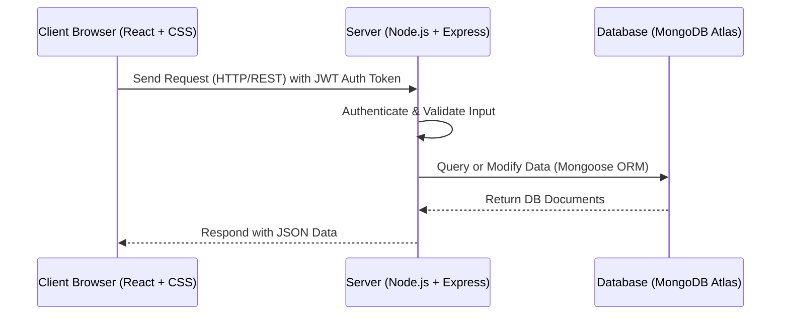

# Project Technical Architecture & MVC Pattern

This document describes the design patterns and architectural layers of the **Online Complaint Registration** application.

---

## 1. Technical Architecture Overview

The system follows a **Client-Server Architecture** separating the user interface from the server-side business logic and data storage.



### Components:
1. **Frontend Client (View / Presentation Layer)**:
   - Built with **React.js** for a highly responsive, single-page application (SPA).
   - Styled with custom premium **CSS** providing glassmorphic card designs, custom inputs, neon-glowing components, and standard grids.
   - Leverages **Axios** to send async HTTPS requests to REST API endpoints.
   
2. **Backend Server (Controller / Routing Layer)**:
   - Built with **Node.js** and **Express.js** as the server runtime and routing framework.
   - Manages security via JSON Web Tokens (JWT) for stateless authenticated sessions.
   - Provides REST APIs to fetch, log, and update complaint records.

3. **Database (Model / Data Layer)**:
   - Hosted on **MongoDB Atlas** (cloud MongoDB service).
   - Offers flexible storage for client details, admin inputs, and complaint records.
   - Interfaced through the **Mongoose** Object Document Mapper (ODM).

---

## 2. MVC Pattern Design

The application separates concerns strictly following the **Model-View-Controller** design pattern:

```
                  ┌──────────────┐
                  │    VIEW      │ <───────┐
                  │ (React Web)  │         │
                  └──────┬───────┘         │ 3. Update View
                         │                 │
            1. Actions   │                 │
                         ▼                 │
                  ┌──────────────┐         │
                  │  CONTROLLER  │ ────────┘
                  │(Express APIs)│
                  └──────┬───────┘
                         │
            2. Reads     │
               & Writes  ▼
                  ┌──────────────┐
                  │    MODEL     │
                  │ (Mongoose)   │
                  └──────────────┘
```

### 🗃️ Models (Data Layer - `backend/models/`)
* Define the structural schema and validation rules for database records.
* **User Model**: Holds security credentials, contact details, and user authorization roles (`user` vs `admin`).
* **Complaint Model**: Stores complaint details, tracking tags, timeline updates, and user references.

### 💻 Views (User Interface Layer - `frontend/src/`)
* Render the pages and UI elements dynamically based on backend data.
* Receive user interaction, dispatch updates, and update local state securely using React Context.

### ⚙️ Controllers / Routes (Logic Layer - `backend/routes/` & `backend/middleware/`)
* Orchestrate request dispatching and coordinate database CRUD operations.
* Validate JSON input payloads and return appropriate HTTP status codes (e.g. `200 OK`, `400 Bad Request`, `401 Unauthorized`).
