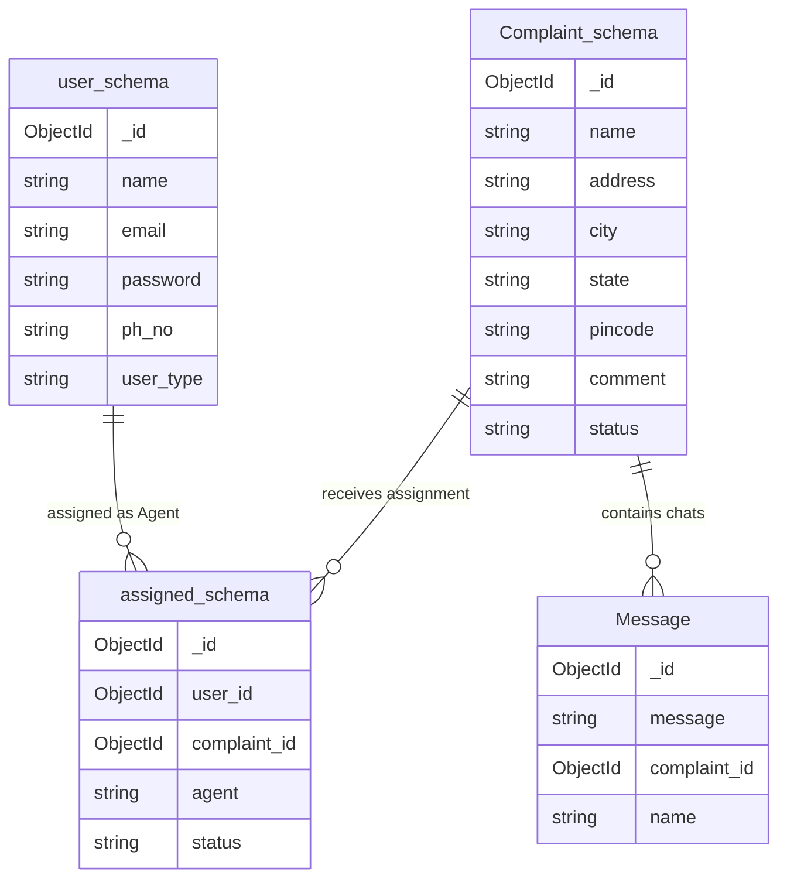

# Entity-Relationship (ER) Diagram & Schema Specification

This document details the database schemas and relationships for the **Online Complaint Registration** application as illustrated in the project ER diagram.

---

## 1. ER Diagram Visualization

The database is built on MongoDB and contains four primary collections: `user_schema`, `Complaint_schema`, `assigned_schema`, and `Message` schema.

---

## 2. Database Collection Definitions

### 👤 1. User Collection (`user_schema`)
Stores profiles and credentials for all participants: customers (ordinary users), agents (officers/technicians), and admins.

* **`_id`** (ObjectId): Unique user ID (auto-generated).
* **`name`** (String): Full name of the user.
* **`email`** (String): Unique email address used for login authentication.
* **`password`** (String): Encrypted password hash.
* **`ph_no`** (String): User's phone number.
* **`user_type`** (String): The role classification (e.g., `user`, `agent`, `admin`).

---

### 📝 2. Complaint Collection (`Complaint_schema`)
Stores the details of complaints logged by citizens.

* **`_id`** (ObjectId): Unique complaint ID.
* **`name`** (String): Name of the complainant or the issue.
* **`address`** (String): Location address related to the complaint.
* **`city`** (String): City of the incident.
* **`state`** (String): State of the incident.
* **`pincode`** (String): Postal PIN code.
* **`comment`** (String): Description or description details of the issue.
* **`status`** (String): Current stage (e.g., `Pending`, `In Progress`, `Resolved`).

---

### 🤝 3. Assignment Collection (`assigned_schema`)
Maps complaints to the respective agent (officer/technician) handling the case.

* **`_id`** (ObjectId): Unique assignment record ID.
* **`user_id`** (ObjectId): References the assigned agent's unique ID (`user_schema._id`).
* **`complaint_id`** (ObjectId): References the unique complaint ID (`Complaint_schema._id`).
* **`agent`** (String): Agent's identifier/name for quick lookup.
* **`status`** (String): Progress status of the assignment (e.g., `Assigned`, `Active`, `Closed`).

---

### 💬 4. Chat Message Collection (`Message`)
Handles the real-time chat history communication channel between customers and assigned agents.

* **`_id`** (ObjectId): Unique message ID.
* **`message`** (String): Text message content.
* **`complaint_id`** (ObjectId): References the associated complaint ID (`Complaint_schema._id`).
* **`name`** (String): Name of the message sender (customer or agent).
